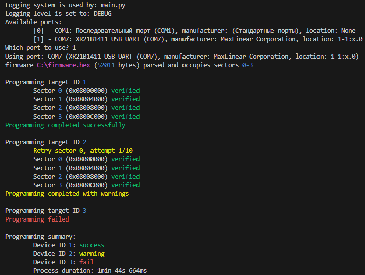
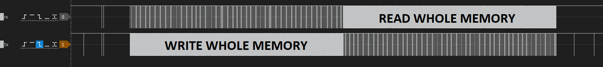
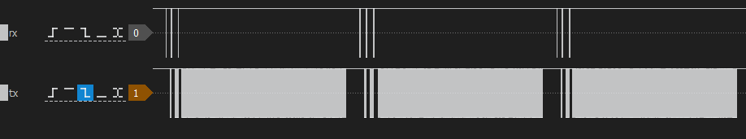
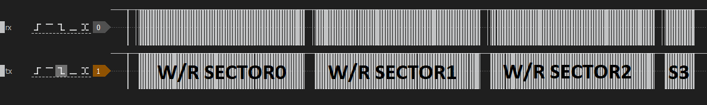
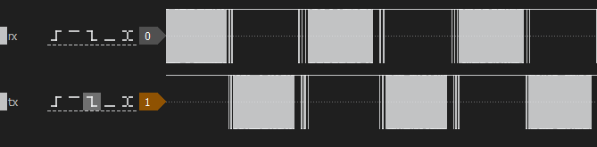

# stm32-uart-prog

A mass-programming utility for STM32 MCU's over UART designed to be reliable and noise-resistant when used on RS-485 physical layer. It targets workflows where many identical STM32 devices need to be programmed in sequence over one shared bus.



## Why this tool exists
Official tools like **STM32CubeProgrammer** support UART bootloader programming but are often brittle on noisy lines, needs additional CLI scripting in automated setups (especially RS-485 with DE/RE toggle), frequently encounter disconnects, failures to detect the bootloader, and general instability when programming many devices.  
`stm32-uart-prog` aims to address this by:

- Erasing by sectors, writing/reading by pages (chunks) instead of erasing/writing/reading the whole memory occupied by further firmare. This helps to track any error earlier.
- Improving UART reliability, including retry logic and timeouts tuned for real-world RS-485 environments.
- Being more tolerant of bootloader activation timing glitches.
- Focusing on mass programming of identical targets rather than one-off interactively driven flashing.

## Features
- Upload hexfile's parsed content to STM32 devices over UART using the ROM bootloader.
- Designed for use with RS-485 line drivers and shared serial buses.
- Retries and timeouts optimized for noisy and electrically challenging environments.
- Auto recovery after detecting errors, such as line noise or usb-rs485 converter reconnect. 
- Simple command-line interface for scripting and automation.
- Written in Python for cross-platform use (Linux, Windows, macOS).

## STM32CubeProgrammer data flow
Data verified after all occupied sectors erased and written with firmware data



## stm32-uart-prog data flow
Data verified after every page/chunk write, if verify fails - erase sector again and try another attempt




## Application-Specific Control Logic (`context.py`)
This project intentionally separates generic STM32 UART programming logic from application/system-specific control logic. The latter is implemented in `context.py` and **must be modified by the user** to match their hardware topology and firmware behavior.

- `context.py` is **not optional** for multi-target setups.
- It is expected to be customized per project.
- There is no universal default implementation that fits all hardware designs.

Failure to implement proper target silencing and bootloader entry logic will result in unreliable or undefined behavior.
#### 1. Silencing devices on the bus
When all devices are executing a user application, there is a chance that during the hexfile data flow, one of the devices on the bus recognizes the data template as a valid request and will be able to respond to it in accordance with the application protocol.   

Application firmware **must not respond to UART requests** after silent command is issued until it receives explicit permission.  
So while programming, all targets must remain completely silent. If any inactive target responds to UART traffic during flash operations, programming will fail.  

The exact method is system-dependent and must be implemented in `context.py:be_quiet()`.

#### 2. Entering the STM32 ROM bootloader
Take into account that only one target should be put into bootloader and other devices must be silent.
`context.py:enter_bootloader()` must define how a selected target is forced into the STM32 system (ROM) bootloader.  
This can be done using either:

- Software approach
    - Proper cleanup of clocks, peripherals, interrupts, and stack.
    - Jump to system memory bootloader from the running application.
    - If using any RTOS, then first set some flag in FLASH, perform target reset, check for the flag before scheduler start.  
    If flag is set, clear it and jump to bootloader.

- Hardware approach
    - Control of BOOT0 and RESET pins via GPIO or external logic.
    - Power cycling or forced reset into bootloader mode.

The programmer does not assume *how* bootloader entry is achieved - only that `context.py` provides a reliable implementation.

## Installation
- Adapt `context.py` to specific application.
- Clone the repository and install dependencies:
```sh
git clone https://github.com/FT9R/stm32-uart-prog.git
cd stm32-uart-prog
pip install -e .
```
- Verify the installation
```sh
stm32-uart-prog --help
```

## Usage
```sh
stm32-uart-prog --hexfile firmware.hex --targets 1-2
```

## TODO
1. Extend supported MCU's (now only supported devices: **STM32F405xx/07xx** and **STM32F415xx/17xx**).
    - It is because of different FLASH memory layouts and supported bootloader commands.